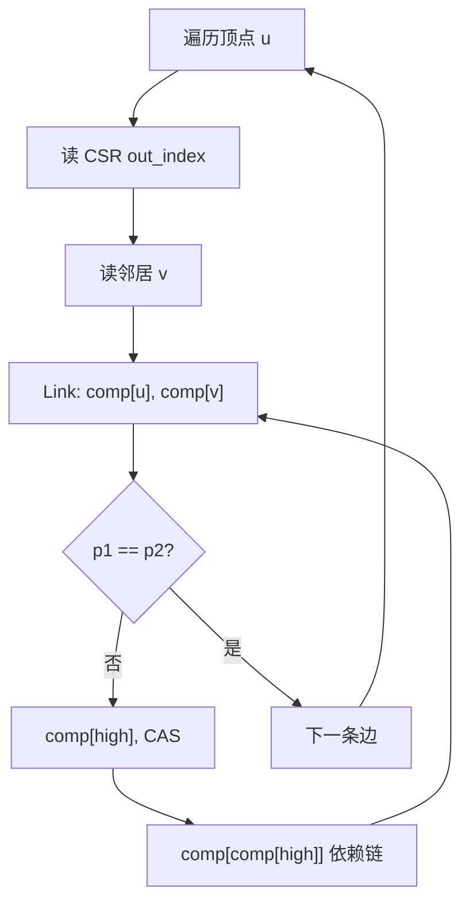

`cc.cc` 实现的是 GAPBS 的 **Afforest 连通分量算法**（Union-Find + 子图采样）。从代码结构和访存行为看，热点大致如下。

## 构造真实的图

make bench-graphs

## 编译： 

make cc WITH_TAO=1  TAO_DIR=/home/ice/src/champ-sim-sdc/lib  arch=Linux_Serial 

## 运行：


OMP_NUM_THREADS=1 \
  ./cc -f benchmark/graphs/twitter.sg -n 1

  
## 整体执行流程

`main` 只做图构建和 benchmark 包装，真正算力在 `Afforest()`：

```95:150:/home/ice/src/sdc-benchmark/tao/gapbs/src/cc.cc
pvector<NodeID> Afforest(const Graph &g, bool logging_enabled = false,
                         int32_t neighbor_rounds = 2) {
    // 1. 初始化 comp[n] = n
    // 2. neighbor_rounds 次子图采样 (Link + Compress)
    // 3. SampleFrequentElement 找最大中间分量
    // 4. 最终 Link 扫剩余边（跳过最大分量）
    // 5. 最后一次 Compress
}
```

默认 `neighbor_rounds=2`，所以 **`Compress` 会跑 3 次**（采样 2 次 + 最终 1 次）。

---

## 热点排序（按 CPU 时间占比）

### P0：`Link()` — 最核心、最不规则

```41:55:/home/ice/src/sdc-benchmark/tao/gapbs/src/cc.cc
void Link(NodeID u, NodeID v, pvector<NodeID>& comp) {
  NodeID p1 = comp[u];
  NodeID p2 = comp[v];
  while (p1 != p2) {
    NodeID high = p1 > p2 ? p1 : p2;
    NodeID low = p1 + (p2 - high);
    NodeID p_high = comp[high];
    if ((p_high == low) ||
        (p_high == high && compare_and_swap(comp[high], high, low)))
      break;
    p1 = comp[comp[high]];  // ← 依赖链
    p2 = comp[low];
  }
}
```

**为什么热：**
- 每条边（或采样边）都会调用一次
- 最终阶段要对几乎所有边调用（跳过最大分量里的点）
- `while` 循环次数不固定，路径长度取决于并查集树深

**访存特征：**
| 访问 | 模式 | 难点 |
|------|------|------|
| `comp[u]`, `comp[v]` | 随机读 | 地址由顶点 ID 决定，无空间局部性 |
| `comp[high]`, `comp[low]` | 随机读 | 同上 |
| `comp[comp[high]]` | **load-use 依赖链** | 下一次 load 依赖上一次结果，ILP 差 |
| `compare_and_swap(comp[high])` | 原子写 | 多线程竞争、false sharing |

这是典型的 **不规则间接访存 + 指针追逐**，Stride/Next-Line 预取基本无效。

---

### P0：`Compress()` — 全图扫描 + 指针压缩

```59:66:/home/ice/src/sdc-benchmark/tao/gapbs/src/cc.cc
void Compress(const Graph &g, pvector<NodeID>& comp) {
  #pragma omp parallel for schedule(dynamic, 16384)
  for (NodeID n = 0; n < g.num_nodes(); n++) {
    while (comp[n] != comp[comp[n]]) {
      comp[n] = comp[comp[n]];
    }
  }
}
```

**为什么热：**
- 对 **每个顶点** 做指针压缩
- 默认跑 **3 次**（2 次采样后 + 1 次最终）
- 复杂度 O(|V| × α)，但内层 `while` 在树深较大时仍可观

**访存特征：**
- 外层 `n` 顺序遍历 → `comp[n]` 有空间局部性（顺序扫描）
- 内层 `comp[comp[n]]` 仍是 **随机间接读**，且每次迭代有依赖
- 写 `comp[n]` 会污染 cache line，影响后续 `Link` 的读

---

### P1：最终 Link 阶段的 CSR 边遍历

```123:133:/home/ice/src/sdc-benchmark/tao/gapbs/src/cc.cc
for (NodeID u = 0; u < g.num_nodes(); u++) {
  if (comp[u] == c) continue;  // 跳过最大分量
  for (NodeID v : g.out_neigh(u, neighbor_rounds)) {
    Link(u, v, comp);
  }
}
```

**为什么热：**
- 工作量 ≈ **|E| - 最大分量内的边**（无向图 CSR 存双向边）
- 按你的 `graph.md`：默认 degree=16，scale 决定 |V|，边数约 **16×|V|**

**访存特征（CSR 两段式）：**
```
out_index_[u]     → 顺序读（按 u 递增，局部性好）
out_neighbors_[...] → 块内顺序，跨 u 随机
comp[u], comp[v]  → 随机（进入 Link 后更乱）
```

CSR 索引段有一定空间局部性，但一进入 `Link` 就回到 `comp[]` 的随机访问。

---

### P2：子图采样阶段（2 轮）

```106:116:/home/ice/src/sdc-benchmark/tao/gapbs/src/cc.cc
for (int r = 0; r < neighbor_rounds; ++r) {
  for (NodeID u = 0; u < g.num_nodes(); u++) {
    for (NodeID v : g.out_neigh(u, r)) {
      Link(u, v, comp);
      break;  // 每点只处理第 r 条出边
    }
  }
  Compress(g, comp);
}
```

工作量固定为 **2×|V| 次 Link**，比最终扫边小，但仍不可忽视。作用是快速近似连通分量，减少最终阶段的树深。

---

### P3：`SampleFrequentElement()` — 可忽略

只随机采样 1024 次，找最大中间分量 ID，用于最终阶段跳过。相对总时间 <1%。

---

## 访存热点汇总

```
┌─────────────────────────────────────────────────────────┐
│  Afforest 访存热点                                       │
├──────────────┬──────────────┬───────────────────────────┤
│ 数组          │ 访问模式      │ 预取难度                   │
├──────────────┼──────────────┼───────────────────────────┤
│ comp[]       │ 随机 R/W      │ ★★★★★ 最难                │
│ out_index_[] │ 按 u 顺序     │ ★★ 中等                    │
│ out_neighbors_[] │ 块内顺序   │ ★★ 中等                    │
└──────────────┴──────────────┴───────────────────────────┘
```

**`comp[]` 是瓶颈**：大小 = |V| × 4B。scale=20 时约 4M 顶点 → **16MB**，超出 L2，大量 cache miss。

---

## 从微架构角度的理解



1. **内存带宽受限**：大量随机读 `comp[]`，IPC 偏低
2. **依赖链长**：`comp[comp[high]]` 难以流水线化
3. **多线程竞争**：OpenMP + CAS，cache line 争用
4. **分支不可预测**：`Link` 的 `while` 迭代次数不定

---

## 各阶段时间占比（经验估计，大图）

| 阶段 | 占比（估） | 主要操作 |
|------|-----------|----------|
| 最终 Link + Compress | **50–70%** | 扫全图边 + 指针压缩 |
| 子图采样 Link×2 + Compress×2 | **20–35%** | 2×|V| 次 Link |
| 初始化 + SampleFrequent | **<5%** | 可忽略 |

实际比例取决于图结构（RMAT 幂律分布时最大分量很大，最终阶段跳过较多节点会快一些）。

---

## 验证热点的 profiling 命令

```bash
# 单线程先看清楚调用栈
OMP_NUM_THREADS=1 perf record -g ./cc -g 20 -n 16
perf report --stdio | head -50

# 关注：Link, Compress, Afforest 及其占比
```

多线程时 `Link` 里的 CAS 竞争会更明显，单线程更适合分析访存模式。

---

## 和预取研究的关系

`cc` 在你们的 `hotspot.md` 里被标为 **P0 不规则图核**：
- Stride / BOP：**差**（无法预测 `comp[·]` 的随机链）
- Berti / IPCP / Pythia：**中–良**（学习 per-IP 的间接模式）
- SDC：**有潜力**（profile `Link`/`Compress` 里的 `comp[·]` 访问链）

如果你接下来要做 ChampSim trace 或手工加 hint，最值得 profile 的 PC 是：
1. `Link` 里 `comp[comp[high]]` 那条 load
2. `Compress` 里 `comp[comp[n]]` 那条 load
3. CSR 遍历里 `out_neighbors_[...]` 的 load


## 热点实测占比（gprof，kernel-only）

条件：`-fno-inline`，从 `/tmp/cc_g20.sg` 读图，50 trials，不含图生成。

| 函数 | self 时间 | 调用次数 | 说明 |
|------|----------|----------|------|
| `CSRGraph::Neighborhood::begin()` | **16.6%** | 2.5亿 | 扫边 |
| **`Link`** | **13.8%** | 5759万 | 并查集合并 |
| `Afforest`（框架） | 13.1% | 137万 | 外层循环 |
| **`Compress`** | **6.9%** | **150** | 50 trial × 3 次 |
| `SampleFrequentElement` | ~0% | — | 可忽略 |

在 `Afforest` 子树里，`Compress` 约占 **~14%**（含子调用），低于 `Link`（~22%）。

## 为什么算热点

```59:66:/home/ice/src/sdc-benchmark/tao/gapbs/src/cc.cc
void Compress(const Graph &g, pvector<NodeID>& comp) {
  #pragma omp parallel for schedule(dynamic, 16384)
  for (NodeID n = 0; n < g.num_nodes(); n++) {
    while (comp[n] != comp[comp[n]]) {
      comp[n] = comp[comp[n]];
    }
  }
}
```

1. **全图扫描**：每次对全部 |V| 顶点做指针压缩；默认跑 **3 次**（2 次子图采样 + 1 次最终）。
2. **访存难**：`comp[n]` 顺序读还好，`comp[comp[n]]` 是**随机间接读**，和 `Link` 一样难预取。
3. **内层 `while` 次数不定**：采样阶段树还深时，单点可能多次迭代。

g20（约 104 万顶点）上，3 次 `Compress` ≈ **300 万次顶点处理**；而 `Link` 在最终阶段要处理约 **1500 万条边**，调用次数差两个数量级。

## 和 `-O3` 正常二进制的关系

用默认 `-O3` + OpenMP 编译时，`Compress` 常被内联进 `Afforest` 的并行循环，**gprof/perf 里可能看不到独立符号**，时间会并进 `Afforest` 或 `frame_dummy`。从算法和 `-fno-inline` 的 6.9% 看，它仍然是不可忽视的热点。

## 结论

| 问题 | 答案 |
|------|------|
| `Compress` 是不是热点？ | **是**，P1 级 |
| 是不是最热？ | **不是**，`Link` + CSR 扫边更热 |
| 值不值得 profile？ | **值得**，尤其是 `comp[comp[n]]` 那条 load |


## 编译与运行

```bash
g++ -std=c++11 -O3 -Wall -pg -fno-inline src/cc.cc -o cc_gprof_serial
./cc_gprof_serial -g 20 -n 200
```

确认：
- 无 `libgomp`
- 无inline 


---


## Flat Profile（kernel 相关，self%）

| Self% | 函数 |
|------:|------|
| 18.5% | `mersenne_twister::_M_gen_rand`（图生成） |
| 17.0% | `frame_dummy` |
| 9.7% | `Neighborhood::begin` |
| 9.4% | `Neighborhood` 构造 |
| 9.4% | **`Link`** |
| 8.8% | **`Afforest`** |
| **5.1%** | **`Compress`** ← 含内层 while |
| 6.8% | `mersenne operator()`（图生成） |

---

## `Compress` 的 call graph

```text
[16] Compress   total 10.9%
     self  0.45s  (45%)
     +     0.51s  仍在 frame_dummy（gprof 采样/探针边界，不是另一函数）
     calls 600
```

内层 `while`（第 62–64 行）的时间**主要落在 `Compress` 的 self 里**；call graph 里还有约一半 children 记到 `frame_dummy`，那是 gprof `-pg` 插桩在函数边界上的常见现象，不是代码又跑出去了。

---

## 按阶段汇总（`-n 200`，无 OpenMP）

| 阶段 | 合计 self%（约） |
|------|-----------------|
| **图生成+建图** | ~28% |
| **Link** | ~9.4% |
| **CSR 扫边** | ~19% |
| **Afforest 框架** | ~8.8% |
| **Compress（含 while）** | **~5.1%** |
| **frame_dummy 等** | ~17% |

---

## 结论

去掉 OpenMP 后，**`Compress` 从 0% 变成 5.1% self、10.9% total**，与预期一致：内层 `while` 就在 `Compress` 符号里，gprof 能直接看到。

**`Compress` 仍是 P1 热点，但明显低于 `Link`（9.4%）和 CSR 扫边（~19%）。**

