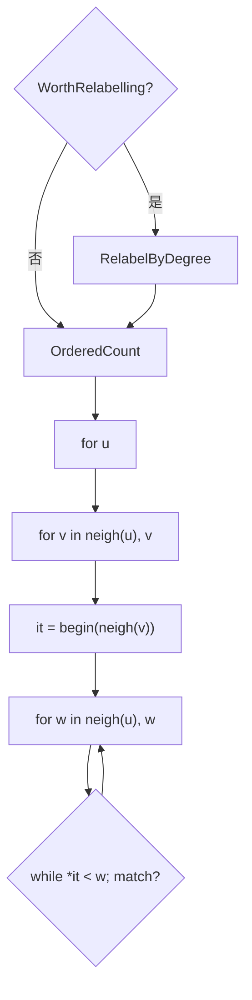

# GAPBS Triangle Counting (`tc`)

`tc.cc`：在 **无向、已排序、无重边** 的 CSR 上做 **有序三角形计数**（只计 `u > v > w` 一次）。主循环是邻接表 **双指针归并**；可选 **按度重标号**。相对 `cc`/`bfs`，**无顶点属性数组、无 CAS、无 UF 依赖链** —— GAP 中访存最规则的对照核。

术语见 [`outline.md`](outline.md)（SEQ / IRR / CSR / gather 等）。

---

## 构造图与运行

```bash
cd tao/gapbs
make bench-graphs   # 官方 TC 用对称化 *U.sg

OMP_NUM_THREADS=1 ./tc -g 20 -n1
OMP_NUM_THREADS=1 ./tc -f benchmark/graphs/twitterU.sg -n1
# 官方 bench 常用 -n3
./tc -f benchmark/graphs/twitterU.sg -n3
```

| 项 | 说明 |
| -- | ---- |
| **`-n N`** | trial 次数（官方 TC 常 **3**） |
| **图** | 必须 **undirected**；邻接按 id **升序**（`SquishCSR` 保证） |
| **官方图** | **`*U.sg`**（对称化），见 `bench.mk` |
| **合成** | `-g` Kronecker 会 symmetrize；g20 常触发 Relabel |

---

## 实测热点（gprof, kron20）

**Setup：** SERIAL 构建（`-pg -no-pie`），`OMP_NUM_THREADS=1`，图 `benchmark/graphs/kron20.sg`，**1 trial**，加载序列化图（`WorthRelabelling` 触发 Relabel）。

| % self | 函数 |
|--------|------|
| **91.4%** | `Hybrid`（`OrderedCount` 已内联） |
| 3.2% | `RelabelByDegree`（含子调用约 **~8%** total） |

**Avg Trial Time：** 12.43 s（+ Relabel **1.10 s**）

主热点在 `Hybrid` → `OrderedCount` 邻接双指针归并；`OrderedCount` 未单独出现在 flat profile。Relabel 为幂律启发式预处理，self 3.2%、含子调用约 8%。

```bash
cd tao/gapbs
# SERIAL: make clean && make CXXFLAGS+='-pg -no-pie'
OMP_NUM_THREADS=1 GMON_OUT_PREFIX=tc_kron20 ./tc -f benchmark/graphs/kron20.sg -n1
gprof ./tc gmon.file
```

原始 gprof：`tao/gapbs/profile_runs/tc_gprof.txt`

---

## 执行流程

```
main → MakeGraph → Hybrid(g)
         ├─ WorthRelabelling? ──是──► RelabelByDegree(g)   ← P1 预处理
         └─ OrderedCount(g')                              ← P0 主热点
```

核心代码：

```52:70:tao/gapbs/src/tc.cc
size_t OrderedCount(const Graph &g) {
  size_t total = 0;
  #pragma omp parallel for reduction(+ : total) schedule(dynamic, 64)
  for (NodeID u=0; u < g.num_nodes(); u++) {
    for (NodeID v : g.out_neigh(u)) {
      if (v > u)
        break;
      auto it = g.out_neigh(v).begin();
      for (NodeID w : g.out_neigh(u)) {
        if (w > v)
          break;
        while (*it < w)
          it++;
        if (w == *it)
          total++;
      }
    }
  }
  return total;
}
```

语义：对每个 `u`，只看邻居 `v < u`；再在 `u` 的邻居里找 `w < v`，用指针 `it` 在 **`v` 的邻接表**上归并，判断 `w` 是否也是 `v` 的邻居 → 三角形 `(u,v,w)`。

---

## 热点排序

### P0：`Hybrid()` / `OrderedCount()` — 绝对主导（kron20 gprof **91.4%** self）

**为何热**

- 三重循环；复杂度约 \(O(\sum_u \mathrm{deg}(u)^2)\) 量级，hub 顶点极重
- 无原子、无 CAS；时间来自 **大量 CSR 读 + 比较/分支**
- GAP 单 trial 往往最慢之一（g20 约 **十几秒**），不全是 memory stall，也有 **计算/分支**

**内层三层各自干什么**

| 层 | 代码 | 作用 |
| -- | ---- | ---- |
| L1 | `for u` | 扫全部顶点 |
| L2 | `for v : out_neigh(u)`，`v>u` 早停 | 枚举边 `(u,v)`，`v<u` |
| L3 | `for w : out_neigh(u)` + `while (*it < w)` | 用 `v` 的邻接表与 `u` 的前缀做归并 |

---

### P1：`RelabelByDegree()` — 可选预处理（kron20 gprof **3.2%** self / ~8% total）

启发式 `WorthRelabelling`：均度 ≥10 且采样均值/中位数显示幂律 → 按度降序重标号并重建 CSR。

- **kron20 实测：** Relabel **1.10 s**，Trial **12.43 s** → Relabel 约 **8%** total（gprof self 3.2%）
- 大图上 OrderedCount 更长，Relabel **占比通常更低**
- Relabel 本身：算度、排序、写新 `neighs`、每行再 sort → **SEQ 写 + 排序算力**，非 IRR 主战场

### P2：`WorthRelabelling()` — 可忽略

≤1000 次 `out_degree` 采样 + sort，一次调用。

### 不计：`TCVerifier`

仅 `-v`；内部 `set_intersection`，不计入正式 timing。

---

## 访存模式分析（相对 `cc`）

### 读哪些数组？

| 数组 | 角色 | 模式（`outline` / `Tao.md`） |
| ---- | ---- | ---------------------------- |
| `out_neighbors_[]` | 邻接 ID 列表 | **SEQ** 扫段；全局上多次跳到不同行 |
| `out_index_[]` | 每顶点邻接起止 | 按 `u`/`v` 读指针，近似 **SEQ**（随 `u` 递增） |
| 顶点属性（`comp`/`parent`/…） | **无** | — |

工作集 ≈ **整图 CSR（只读）**。`-g 20` 邻接表仍远大于 2MB LLC，会打 DRAM，但访问形态比 `cc` 友好得多。

### 三种 SEQ / 半规则流（TAO 视角）

```
对每个 u:
  流 A：扫 out_neigh(u) 得 v          ← SEQ，早停 v>u
  对每个 v:
    流 B：it 从 out_neigh(v).begin() 单调 ++   ← 段内 SEQ
    流 C：再扫 out_neigh(u) 得 w（w≤v）       ← 同一段被反复 SEQ 扫
    归并：比较 w 与 *it（模式 13 双指针）
```

| 流 | 模式编号（Tao） | 规则性 | 说明 |
| -- | --------------- | ------ | ---- |
| A / C：`out_neigh(u)` | **1 SEQ** | ★★★★★ | 同一 `u` 下 C 被 **每个 v 重扫一遍** → 时间局部性极好，L1/L2 易命中 |
| B：`out_neigh(v)` 上 `it++` | **1 SEQ** + **13 归并** | ★★★★ | 段内顺序；换 `v` 时 **基址跳到另一行**（行首 IRR，行内 SEQ） |
| `*it` vs `w` | 短依赖 | ★★★ | 仅指针自增，**不是** `comp[comp[]]` 那种深 UF 链 |

### 和 `cc` 的关键差异

| 维度 | **tc** | **cc** |
| ---- | ------ | ------ |
| 主数据结构 | 仅 CSR | CSR + **`comp[]`** |
| 主难点 | hub 上 \(O(\mathrm{deg}^2)\) **算力/带宽** | **`comp[comp[]]` IRR + CAS** |
| 预取 | Stride / next-line **应对症** | Stride≈无效 |
| 同步 | 无（reduction 聚合） | OpenMP + CAS |
| 预期 TAO vs no | 提升有限或中等（已较规则） | 可大幅（如 kron 上数倍） |

**半不规则点（勿忽视）：** 每个 `(u,v)` 把 `it` 重置到 `out_neigh(v).begin()` —— `v` 由邻接 ID 决定，**下一行 CSR 的起点是 gather 式**（模式 3 的“跳到 B 的某一段”），但跳进去之后整段 **SEQ 扫完**，整体仍远好于逐元素 `parent[v]` CAS。

---

## 微架构直觉



1. **带宽 + 计算混合**：大量顺序读 CSR；内层比较/`it++` 使 IPC 不必很低。  
2. **`u` 的邻接表反复扫**：对固定 `u`，L1 常能兜住 `out_neigh(u)`；瓶颈更常在 **换 `v` 时拉 `v` 的长邻接**。  
3. **分支**：`v>u` / `w>v` 早停减少无效工作；归并 `while` 仍有分支开销。  
4. **ChampSim**：相对 `cc`，no / stride / Berti 差距应 **小得多**；TAO 主打 `tao_stride`，不宜期待 `cc` 那种相对 no 的数倍。

---

## 阶段时间（kron20 gprof 实测 + g20 经验）

| 阶段 | 占比（估） | kron20 gprof 实测 | 说明 |
| ---- | ---------- | ----------------- | ---- |
| **Hybrid / OrderedCount** | **~90%+** | **91.4%** self（OrderedCount 内联） | Trial **12.43 s** |
| **RelabelByDegree** | **~5–10%** | **3.2%** self / **~8%** total；Relabel **1.10 s** | 幂律 kron 常触发 |
| WorthRelabelling | <0.1% | — | 一次采样 |

```bash
OMP_NUM_THREADS=1 ./tc -g 20 -n1
# 关注打印：Relabel / Trial 时间；-l 可看更细 log（若启用）

OMP_NUM_THREADS=1 perf record -g ./tc -g 20 -n1
perf report --stdio | head -60
# 热点应落在 OrderedCount 内层 while (*it < w)
```

---

## 与预取 / TAO

| 方法 | 预期 |
| ---- | ---- |
| **Stride / next-line / BOP** | **良–优**（本核主对照） |
| **Bingo / SPP** | **良**（重复扫 CSR） |
| **Berti / IPCP / Pythia** | **中–良**；易学到 SEQ，相对 no 提升通常 **远小于** `cc` |
| **TAO** | **`tao_stride`** 绑 `out_neighbors_`（± `out_index_`）；**不需要** indirect/list 打顶点属性 |

### TAO hint 候选

| 目标 | 引擎 | 说明 |
| ---- | ---- | ---- |
| `out_neighbors_[]` 全局或按行 | **`tao_stride`** | BASE/RANGE/NODESIZE=`sizeof(NodeID)` |
| 双流归并 | **stride ×2**（模式 **13**） | 一路跟 `u` 的扫，一路跟 `it`；收益看实现能否双描述符 |
| `out_index_[u]` | stride（次要） | 随 `u` 递增读 |

**不要** 套 `cc` 的 `comp[]` / UF ensemble。

### ChampSim 评测建议

- 与 `cc` **同配置**跑：`no` / `ip_stride` / `berti` / `tao`  
- 预期叙事：`tc` = **规则基线**（stride 有效、TAO≈stride）；`cc` = **不规则杀伤**（stride≈no、TAO≫stride）  
- 图：冒烟 `-g 20`；正文用 `*U.sg` 真实对称图

---

## 与其他 kernel（摘要）

详见 [`outline.md`](outline.md)。

| 维度 | **tc** | **pr** | **bfs** | **cc** |
| ---- | ------ | ------ | ------- | ------ |
| 顶点属性 | 无 | `scores` gather | `parent` CAS | `comp` UF 链 |
| 最热循环 | 邻接归并 | pull gather | TD/BU | Link/Compress |
| 访存规则性 | **最高** | 中 | 低 | **最低** |
| 官方图 | **`*U.sg`** | `*.sg` | `*.sg` | `*.sg` |

---

## 结论

| 问题 | 答案 |
| ---- | ---- |
| 最热函数？ | **`Hybrid()` / `OrderedCount()`** 内层归并（`while (*it < w)`，kron20 gprof 91.4% self） |
| 访存主型？ | **CSR 双指针 SEQ / 模式 13**；换行时有轻量 IRR |
| 有无 UF/CAS/gather 属性？ | **无** |
| 预处理？ | 幂律图常 **RelabelByDegree**（次要） |
| TAO？ | **`tao_stride`**；作 GAP **友好对照**，不验证间接预取上限 |
| 官方跑法？ | **`-f <graph>U.sg -n3`**，`OMP_NUM_THREADS=1` 便于 profile |

可以使用纯跨步预取提高IPC。